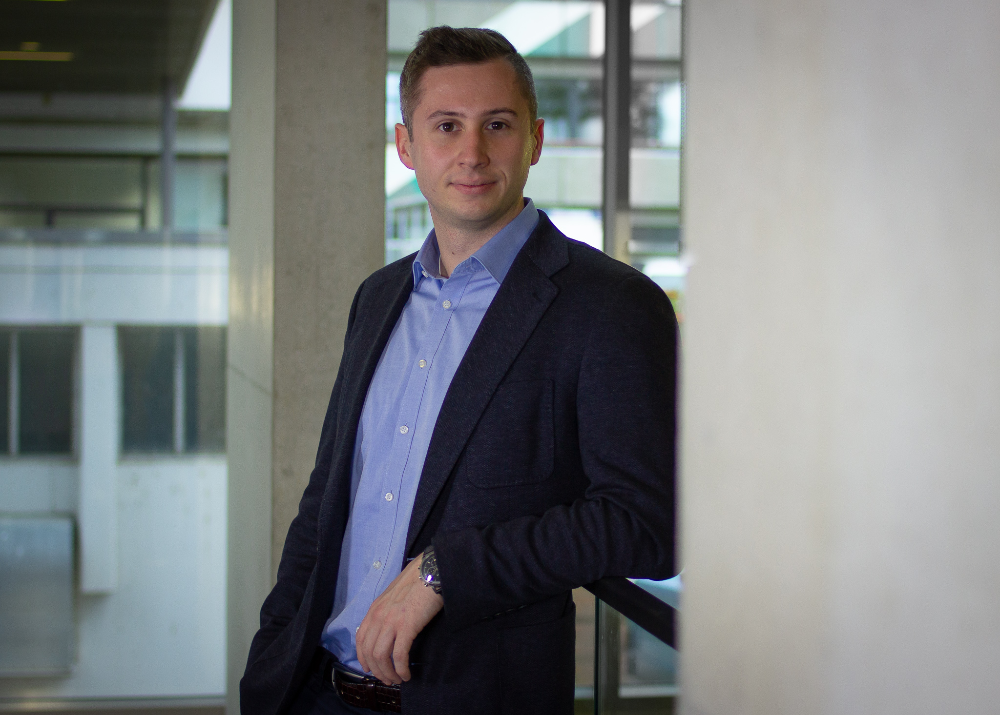

## Short Biography

A full cv is available on request, send an email to konstantinbaetz `at` gmail `dot` com.

### Professional Profile

I left academia in part because I felt my impact on policy was limited. I have thus adjusted my career path and I am currently working in strategic political consulting at [Miller & Meier Consulting](https://www.miller-meier.de/) (please note disclaimer below). I am still passionate about political science, especially the study of foreign policy and its interactions with economics. I write about this and other things on [my blog](infiniteregression.substack.com).

### Academic background

I hold a PhD in International Politics from the University of Konstanz. The topic of my dissertation is *Economic Statecraft in Multipolar Times*. As the title indicates, I am interested in the relationship between economics and foreign policy, specifically the use of economic means for foreign policy ends. This includes the study of trade wars and sanctions, which I analyze from the vantage of quantitative political science. 

I firmly belive that foreign policy research should not be confined to the ivory tower. Hence I take an interest in the trade-off between policy relevance and methodological rigour. In my view, much of the current research output is hard to read for policy makers and does not adress their immediate questions. My [own work](./writings.md) aims to reconcile solid methods and policy relevance.

Before leaving academia, my home was the University of Konstanz, where I am working at the [Chair of International Politics](https://www.polver.uni-konstanz.de/gschneider/). I was also affiliated with the [Graduate School of Behavioral Sciences](https://gsbs.uni-konstanz.de/). Before my PhD, I attained a BA in Philosophy & Economics from the University of Bayreuth and a MSc in Political Economy from the Universiy of Konstanz.

I have presented my research at the European Political Science Association and American Political Science Association conferences. 

### Other Interests

In my free time I enjoy playing chess, going for a bike ride, lifting weights in the gym and reading Brandon Sanderson books. I also volunteer with the [Amnesty International](https://twitter.com/AmnestyKonstanz) group in Konstanz.

## Disclaimer

Any writings listed here are solely my responsibility and do not refelect the opinions of Miller & Meier Consulting. 

[back to homepage.](./index.md)
